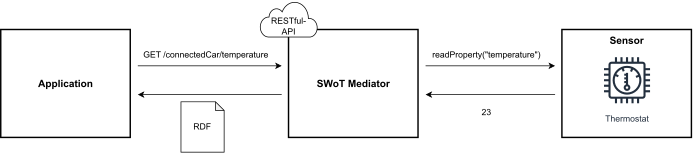

# SemWoT Mediator

In this project, the SemWoT Mediator is presented. The SemWoT Mediator integrates Web of Things Devices into the Semantic Web by mapping the interaction affordances of WoT devices accessable via a RESTful Read-Write Linked Data HTTP interface. The RESTful HTTP interface is generated mapping IoT protcols to HTTP and data to RDF. 

## Preconditions

- node v20.8.0
- npm 10.1.0

## Installation

- Download the project
- Install all packages with `npm install`

## Configuration

1. Open the Mediator in 'src/mediator.js'.
2. Change the variables IP and PORT according to the server on which the Mediator should run.
3. Change the variables IP and PORT according to the server on which the Thing communicates.

## Start Systems

Start Thing
`cd Things`
`node thing1.js`

Start the mediator
`node SemWoT.js`

Start the client
`node client.js`

## Interactions

The following example represents a possible ReadProperty interaction using a GET request. The response is returned as an RDF file.

Similarly, the interactions such as WriteProperty, ActionInvocation and SubscribeEvent are provided with a Thing via a POST interface and UnsubscribeEvent via a DELETE interface. RDF templates are sent for these interactions.
